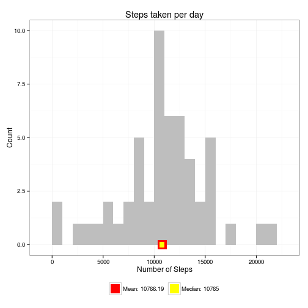
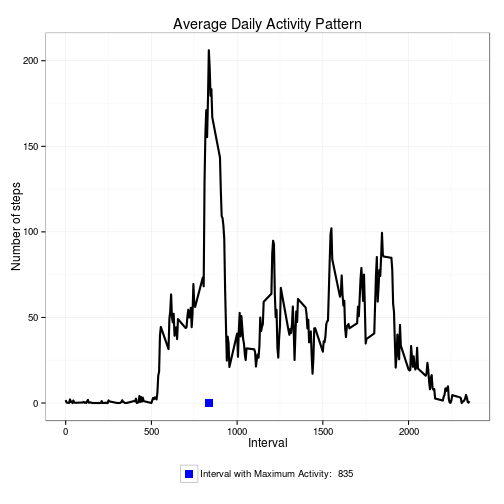
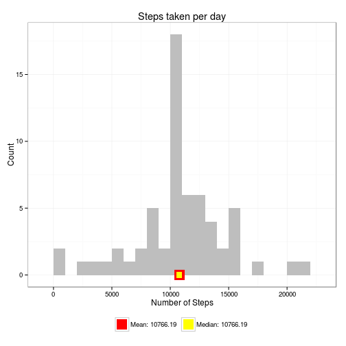
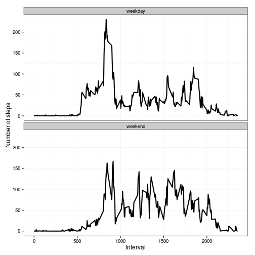

# Project 1 for Peer Assessment (Reproducible Research)

A set of personal activity data are obtained for this assignment from a personal activity monitoring device. The data are collected every 5 minutes   through out the day. The data acquired are for two months (October and November 2012), which includes the number of steps taken every 5 minutes for   each day. The report is presented under five parts as per the instructions provided at the course website.  

## Loading and preprocessing the data

The following R code will download the data file if it is not already present. Following this, it uncompresses and imports the data as a dataframe.
The interval column is converted to class 'factor', while the date column is converted to class 'Date'. Following this, the data is examined.  


```r
library(ggplot2)  # use ggplot2 for plotting figures

# download and read the data, convert columns for convenience
data <- function() {
    filename = "activity.zip"
    url = "https://d396qusza40orc.cloudfront.net/repdata%2Fdata%2Factivity.zip"
    if (!file.exists(filename)) {
        download.file(url, destfile = filename, method = "curl")
    }
    con <- unz(filename, "activity.csv")
    table <- read.csv(con, header = T, colClasses = c("numeric", "character", 
        "numeric"))
    table$interval <- factor(table$interval)
    table$date <- as.Date(table$date, format = "%Y-%m-%d")
    table
}
table <- data()
```


Summarize the data.

```r
summary(table)
```

```
##      steps            date               interval    
##  Min.   :  0.0   Min.   :2012-10-01   0      :   61  
##  1st Qu.:  0.0   1st Qu.:2012-10-16   5      :   61  
##  Median :  0.0   Median :2012-10-31   10     :   61  
##  Mean   : 37.4   Mean   :2012-10-31   15     :   61  
##  3rd Qu.: 12.0   3rd Qu.:2012-11-15   20     :   61  
##  Max.   :806.0   Max.   :2012-11-30   25     :   61  
##  NA's   :2304                         (Other):17202
```

```r
str(table)
```

```
## 'data.frame':	17568 obs. of  3 variables:
##  $ steps   : num  NA NA NA NA NA NA NA NA NA NA ...
##  $ date    : Date, format: "2012-10-01" "2012-10-01" ...
##  $ interval: Factor w/ 288 levels "0","5","10","15",..: 1 2 3 4 5 6 7 8 9 10 ...
```


## What is mean total number of steps taken per day?

A histogram of the total number of steps taken per day is plotted with a bin interval of 1000 steps. The mean and median of the daily total steps are given.


```r
stepsperday_calc <- function(table) {
    stepsperday <- aggregate(steps ~ date, table, sum)
    colnames(stepsperday) <- c("date", "steps")
    stepsperday
}

stepsperday_plot <- function(stepsperday, mean_steps, median_steps) {
    col_labels = c(paste("Mean:", mean_steps), paste("Median:", median_steps))
    cols = c("red", "yellow")
    
    ggplot(stepsperday, aes(x = steps)) + geom_histogram(fill = "gray", binwidth = 1000) + 
        geom_point(aes(x = mean_steps, y = 0, color = "red"), size = 7, shape = 15) + 
        geom_point(aes(x = median_steps, y = 0, color = "yellow"), size = 4, 
            shape = 15) + scale_color_manual(name = element_blank(), labels = col_labels, 
        values = cols) + labs(title = "Steps taken per day", x = "Number of Steps", 
        y = "Count") + theme_bw() + theme(legend.position = "bottom")
}

stepsperday <- stepsperday_calc(table)
mean_steps = round(mean(stepsperday$steps), 2)
median_steps = round(median(stepsperday$steps), 2)
stepsperday_plot(stepsperday, mean_steps, median_steps)
```

 

**For the total number of steps/day:**
- **Mean: 10766.19**
- **Median: 10765**

## What is the average daily activity pattern?

The average daily pattern of the number of steps taken were plotted against the time interval. The interval that clocks the maximum number of steps on an average is also marked.


```r
stepsperinterval_calc <- function(table) {
    stepsperinterval <- aggregate(table$steps, by = list(interval = table$interval), 
        FUN = mean, na.rm = T)
    # convert to integers
    stepsperinterval$interval <- as.integer(levels(stepsperinterval$interval)[stepsperinterval$interval])
    colnames(stepsperinterval) <- c("interval", "steps")
    stepsperinterval
}

activity_pattern_plot <- function(steps_per_interval, max_step_interval) {
    col_labels = c(paste("Interval with Maximum Activity: ", max_step_interval))
    cols = c("blue")
    
    ggplot(steps_per_interval, aes(x = interval, y = steps)) + geom_line(color = "black", 
        size = 1) + geom_point(aes(x = max_step_interval, y = 0, color = "yellow"), 
        size = 4, shape = 15) + scale_color_manual(name = element_blank(), labels = col_labels, 
        values = cols) + labs(title = "Average Daily Activity Pattern", x = "Interval", 
        y = "Number of steps") + theme_bw() + theme(legend.position = "bottom")
}

steps_per_interval <- stepsperinterval_calc(table)
max_step_interval <- steps_per_interval[which.max(steps_per_interval$steps), 
    ]$interval

activity_pattern_plot(steps_per_interval, max_step_interval)
```

 


The **835<sup>th</sup> interval** has the maximum activity on the average.

## Imputing missing values

To populate missing values, we choose to replace them with the mean value at the same interval across days. The choice is based on the assumption that activities usually follow a daily pattern.


```r
mean_impute <- function(table, defaults) {
    na_indices <- which(is.na(table$steps))
    defaults <- steps_per_interval
    na_replacements <- unlist(lapply(na_indices, FUN = function(idx) {
        interval = table[idx, ]$interval
        defaults[defaults$interval == interval, ]$steps
    }))
    imp_steps <- table$steps
    imp_steps[na_indices] <- na_replacements
    imp_steps
}
datatable_complete <- data.frame(steps = mean_impute(table, steps_per_interval), 
    date = table$date, interval = table$interval)
```


Summarize the new dataset with imputed values:

```r
summary(datatable_complete)
```

```
##      steps            date               interval    
##  Min.   :  0.0   Min.   :2012-10-01   0      :   61  
##  1st Qu.:  0.0   1st Qu.:2012-10-16   5      :   61  
##  Median :  0.0   Median :2012-10-31   10     :   61  
##  Mean   : 37.4   Mean   :2012-10-31   15     :   61  
##  3rd Qu.: 27.0   3rd Qu.:2012-11-15   20     :   61  
##  Max.   :806.0   Max.   :2012-11-30   25     :   61  
##                                       (Other):17202
```


A histogram of the daily total number of steps taken are plotted for the imputed dataset, with a bin interval of 1000 steps. The mean and median values of the daily total steps are given.


```r
complete_stepsperday <- stepsperday_calc(datatable_complete)
complete_mean_steps = round(mean(complete_stepsperday$steps), 2)
complete_median_steps = round(median(complete_stepsperday$steps), 2)
stepsperday_plot(complete_stepsperday, complete_mean_steps, complete_median_steps)
```

 


In this instance, the median value moved closer to the mean than compared to the first histogram.

## Are there differences in activity patterns between weekdays and weekends?

First, add a new column to indicate the day of the week. Following this, divide the dataframe into two, based on  (a) weekday (Monday through Friday) and (b) weekend (Saturday and Sunday). calculate the average steps per interval for weekday and weekend datasets. Plot the two datasets in a single panel for comparison.


```r
dayofweekdata_calc <- function(table) {
    table$weekday <- as.factor(weekdays(table$date))
    weekend <- subset(table, weekday %in% c("Saturday", "Sunday"))
    weekday <- subset(table, !weekday %in% c("Saturday", "Sunday"))
    
    weekend_spi <- stepsperinterval_calc(weekend)
    weekday_spi <- stepsperinterval_calc(weekday)
    
    weekend_spi$dayofweek <- rep("weekend", nrow(weekend_spi))
    weekday_spi$dayofweek <- rep("weekday", nrow(weekday_spi))
    
    dayofweek <- rbind(weekend_spi, weekday_spi)
    dayofweek$dayofweek <- as.factor(dayofweek$dayofweek)
    dayofweek
}
plot_day_of_week_comparison <- function(dow) {
    ggplot(dow, aes(x = interval, y = steps)) + geom_line(color = "black", size = 1) + 
        facet_wrap(~dayofweek, nrow = 2, ncol = 1) + labs(x = "Interval", y = "Number of steps") + 
        theme_bw()
}
dayofweek <- dayofweekdata_calc(datatable_complete)
plot_day_of_week_comparison(dayofweek)
```

 


The activity on the weekends are more spread out over the day compared to the weekdays. This is because the activities on weekdays mostly follow a routine, whereas weekends donot have such routines.
